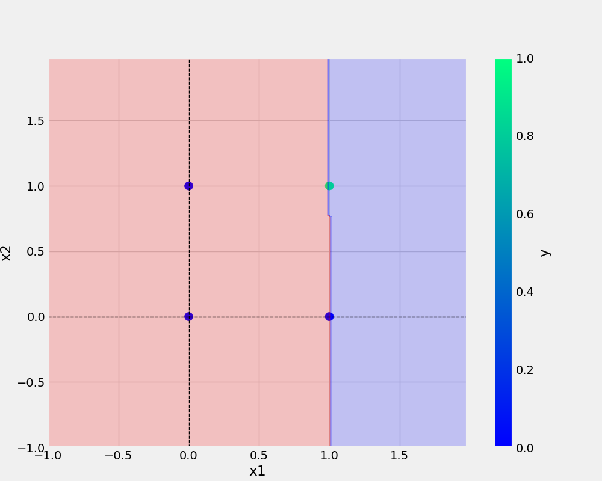

# oneneuron
project_1

'''bash
git add. && git commit -m "docstring updated" && git push origin main
'''

## Add URL -
[Git Handbook](https://guides.github.com/introduction/git-handbook/)

<a href="https://www.w3schools.com">Visit W3Schools.com!</a>

## Add image -



```python
def main(data, eta, epochs, filename, plotFileName):
    
    df = pd.DataFrame(data)

    logging.info(f"This is actual dataframe {df}")

    X, y = prepare_data(df)


    model = Perceptron(eta=eta, epochs=epochs)
    model.fit(X, y)

    _ = model.total_loss()

    save_model(model, filename=filename)
    save_plot(df, plotFileName, model)
```

## dataset

x1|x2|y
-|-|-
0|0|0
0|1|0
1|0|0
1|1|1

### The main programs used are
* and.py
* or.py